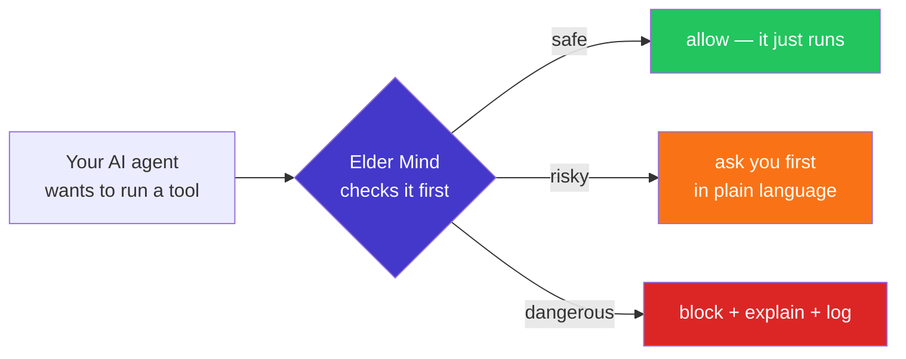
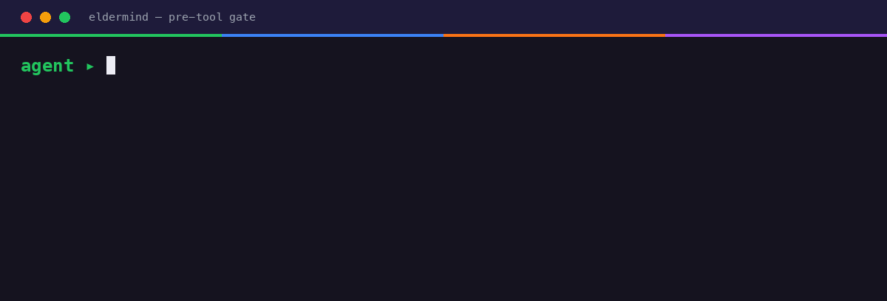

<p align="center">
  
</p>

# Elder Mind Governance Harness

> **The pause a wise elder insists on — the moment before your AI coding agent does something it can't undo.**

[](LICENSE)
[](LICENSE-DOCS)
[](CHANGELOG.md)
[](.github/workflows/ci.yml)
[](docs/TESTING.md)
[](docs/STANDARDS-MAP.md)
[](docs/STANDARDS-MAP.md)

## The problem

Your AI coding agent now *acts on its own* — it runs shell commands, edits files, installs packages, and pushes to git, often faster than you can read along. Most of the time that's a superpower. But it takes only **one** bad call — a stray `rm -rf`, a force-push over `main`, a leaked `.env`, a compromised package pulled from npm — and the damage is done before you can step in. The agent is fast, confident, and doesn't pause to ask "should I?".

## How Elder Mind solves it

Elder Mind gives your agent that pause. It sits at the **exact moment of action**: before a risky tool call runs, it scores the risk, decides — **allow · warn · ask · block** — explains the decision in plain language, and logs it. The decision is simple, readable arithmetic over a policy file — not a black-box model guess — so it runs **on your machine**, needs **no cloud and no API keys**, and gives the **same answer every time**. You install it into the agents you already use in about a minute — or simply ask your agent to set it up for you.



> Hard gate in **Claude Code** and **OpenCode** (and **Kiro** — adapter best-effort, pending live-harness verification) · advisory in **Cursor** and any MCP client · on **Windows, macOS, and Linux**. ([IDE × OS matrix](docs/IDE-SUPPORT.md))

<p align="center">
  
</p>

<sub>The same thing in text (every block is checked, explained, and logged locally):</sub>

```
⛔ Elder Mind blocked: bash(git push --force origin main)
   risk 16/25 (elevated_review) · OWASP ASI02 Tool Misuse · NIST RMF: MANAGE
   ⚠ This tool use can damage your system or exfiltrate data.
   decision EM-2169fd82a466 · logged to .eldermind/audit.jsonl
   to allow: add a rule to .eldermind/policy.yaml
```

---

## Why it's different

Most agent-safety tools are **input/output guardrails** (filter prompts and outputs) or **cluster control planes** (govern deployed agent workloads). Elder Mind is neither.

> **Governance that runs as your coding agent's own pre-tool-use hook — local, deterministic, and auditable on your machine — not a control plane your agent has to phone home to.**

- **Local + deterministic.** The verdict is plain arithmetic (`impact × likelihood`) over a versioned policy file. Same input, same decision, reproducible offline — no model in the decision path, no drift.
- **At the tool-call boundary.** It governs the exact moment your agent decides to run `rm -rf`, force-push, or `curl … | bash` — inside the dev loop, not at a deployment ring.
- **Bring your own LLM.** The optional multi-model "council" review uses *your* agent's model (and any models you already route to). Elder Mind ships **no API keys and makes no cloud calls of its own** — the one exception is the optional supply-chain check, which queries the public OSV database and only when you turn it on.
- **60-second install** into the three agents you already use, guided by your own AI.

---

## Quick start

```bash
# Pre-release (not yet on PyPI) — install from source:
git clone https://github.com/Cyber-Elders/elder-mind-harness && cd elder-mind-harness && pipx install .   # or: pip install .
# Once published this becomes simply:  pipx install eldermind

eldermind init claude-code      # guided setup — or: opencode | kiro | cursor
```

`init` walks you (and your agent) through harness detection, a governance tier, optional supply-chain protection, and council models — then wires the pre-tool hook and writes `.eldermind/`. Prefer non-interactive? `eldermind install claude-code --supplychain`. New here? **[START-HERE.md](START-HERE.md)** routes you by role (developer / team lead / security owner / non-technical).

> **Not comfortable with the command line?** You don't have to be. Ask your AI assistant: *"Install the Elder Mind governance harness and set it up for me."* Elder Mind is built to be installed *by* the agent it will govern — it runs the steps above and explains each choice as it goes.

Try the gate with no agent at all:

```bash
echo '{"action":"bash","target":"git push --force origin main"}' | eldermind check
# -> {"verdict":"block","asi":"ASI02", ...}   exit code 2
```

---

## What's in the harness

| Capability | What it does | Network? |
|---|---|---|
| **Pre-tool gate** | Deterministic `impact × likelihood` → allow / warn / ask / block on a versioned `policy.yaml`. Blocks the **common forms** of destructive deletes, force-push to protected branches, and `curl\|bash`; **prompts** on secrets read/write. Pattern-based — novel phrasings can slip, so it's a high-signal tripwire, not a sandbox ([known bypasses](THREAT_MODEL.md#known-bypasses)). | No |
| **Supply-chain** (opt-in) | On `npm/pip/cargo/...` installs, checks each package against the **OSV** database (+ OpenSSF malicious-packages) with an offline curated fallback, and optionally flags **brand-new versions** (release-age, via deps.dev). Catches known-compromised + suspiciously-fresh packages. | OSV / deps.dev when enabled; degrades offline |
| **Threat detectors** | Heuristic regex surfacing (command-substitution, SSRF-to-metadata, path traversal, …), MITRE-tagged, written to the audit trail. Surfaces — does not hard-block legit code. | No |
| **[Council review](docs/COUNCIL.md)** (BYO-LLM) | **Advisory** path: on high-risk calls the host agent can call the `council_review` MCP tool, which hands *your* model(s) a structured deliberation task; with model routing, votes are combined by a consensus rule. No model? Falls back to asking you. (Not part of the hard-gate hook.) | Uses your model only |
| **Tool-descriptor pinning** | Pins a hash of each MCP/tool descriptor on first use; flags drift ("rug-pulls") if name/schema/command/args/origin change after approval. | No |
| **Audit trail** | Append-only, **hash-chained** `.eldermind/audit.jsonl` — `eldermind verify` detects accidental/partial edits (not tamper-*proof* against an attacker with local write; see [`THREAT_MODEL.md`](THREAT_MODEL.md#self-protection--audit-integrity)). Reproducible decision ids; `eldermind summary` aggregates; `eldermind explain <id>` reconstructs a decision. | No |

**Governance tiers** modulate strictness deterministically: `explorer` (low friction — ask→warn, but never relaxes a block), `practitioner` (default, knowledge-worker safe), `governed` (warn→ask), `operator` (strictest — warn→ask, ask→block). **Observe mode** (`ELDERMIND_MODE=observe`) logs what *would* have happened but never blocks — friction-free onboarding. While observe is on, **nothing is enforced** (the gate says so on every decision); switch it off once you trust the rules.

Two ways it plugs in: a **pre-tool hook** (the hard gate — Claude Code `PreToolUse`, OpenCode `tool.execute.before`, Kiro `preToolUse`) and an **advisory MCP server** (`govern_check`, `council_review`, `scan`, `pin_check`, `audit_log`, `audit_summary`) usable from any MCP client.

See [`docs/ARCHITECTURE.md`](docs/ARCHITECTURE.md) for the wedge, runtime loop, component, and decision-engine diagrams.

---

## Who it's for

| You are… | What you get |
|---|---|
| **A solo developer** running an agent 24/7 | A safety net that blocks the destructive command you didn't see coming — zero infra, install in a minute. |
| **A team lead** rolling out coding agents | A versioned `policy.yaml` in the repo so every teammate's agent obeys the same rules, with an audit trail. |
| **A security / risk owner** | Deterministic, reproducible decisions mapped to OWASP Agentic 2026 + NIST AI RMF, an offline audit log, and an honest threat model. |
| **An air-gapped / privacy-sensitive shop** | Works offline; no keys, no telemetry, no cloud — the council uses *your* model, the supply-chain check is opt-in. |

---

## Standards posture (honest)

Elder Mind is **OWASP Agentic Top 10–aware** and **aligned to the NIST AI RMF four-function structure** (GOVERN / MAP / MEASURE / MANAGE). It is **not** "compliant", "certified", or a complete control set — a local pre-tool hook structurally cannot address everything a cluster overlay can, and we say so. Full rule-by-rule mapping: [`docs/STANDARDS-MAP.md`](docs/STANDARDS-MAP.md).

| | OWASP Top 10 for Agentic Applications (2026) |
|---|---|
| **Enforce** | ASI02 Tool Misuse · ASI04 Agentic Supply Chain · ASI05 Unexpected Code Execution |
| **Enforce / audit** | ASI03 Identity & Privilege Abuse |
| **Improve (council)** | ASI01 Agent Goal Hijack (human/multi-model review) |
| **Out of scope** (documented) | ASI06 Memory Poisoning · ASI07 Inter-Agent Comms · ASI08 Cascading Failures · ASI09 Human-Agent Trust · ASI10 Rogue Agents |

> Reference: OWASP GenAI Security Project — *OWASP Top 10 for Agentic Applications* (2026, final 1.0, 2025-12-09).

---

## What it does NOT do

> **Elder Mind reduces risk; it does not eliminate it.** It is a best-effort, deterministic tripwire — **not** a security guarantee, and not a substitute for OS isolation, code review, and your own judgement. Provided **as is**, with no warranty (see [LICENSE](LICENSE)).

This defines the trust boundary — please read it. See [`THREAT_MODEL.md`](THREAT_MODEL.md).

- **Not a prompt-injection classifier.** It matches command/tool patterns deterministically; pair it with an injection guardrail if you need that.
- **Not "AI-powered."** The gate verdict is arithmetic — that's the point (reproducible, explainable, offline).
- **Not a kernel sandbox.** Rules are policy-level deny/ask, not OS isolation. If an agent shells out around the hook, the gate doesn't see that call.
- **Not a multi-agent monitor.** Inter-agent communication and rogue-agent drift need a runtime overlay.
- **Supply-chain is not a full SCA.** It checks installs against OSV; it is not a substitute for `osv-scanner`/SBOM in CI (though `eldermind scan <lockfile>` will use `osv-scanner` if you have it).

---

## Pairs with (defense in depth)

Elder Mind governs **the action**, one layer after a prompt is formed. It deliberately doesn't try to be everything — pair it with:

- **Prompt-injection / I-O guardrails** — Lakera, NVIDIA NeMo Guardrails, Meta LlamaFirewall, LLM Guard. They reduce malicious *intent* reaching the model; Elder Mind governs the *tool call* if something slips through.
- **Full software-composition analysis** — `osv-scanner`, Socket, Snyk in CI for lockfile/SBOM scanning. Elder Mind catches known-bad packages at the *install moment*; SCA covers the whole tree.
- **Observability / evals** — Langfuse, LangSmith, Arize Phoenix for traces and quality. Elder Mind keeps the *enforcement + local audit* minimal and offline.
- **OS isolation** — run agents in a container / restricted workspace with egress controls. The gate is policy-level, not a kernel sandbox.

The category framing: **local pre-action governance for coding agents** — the safety harness for the moment an agent is about to act, complementing (not replacing) enterprise control planes and guardrail filters.

---

## Commands

| Command | Purpose |
|---|---|
| `eldermind init <tool>` | Guided install (interactive). |
| `eldermind install <tool> [--supplychain]` | Non-interactive install. |
| `eldermind check '<json>'` | Evaluate a tool call (the universal hook target). Exit 0 allow/warn, 2 ask/block. |
| `eldermind scan <install-cmd\|lockfile>` | Supply-chain check (OSV). |
| `eldermind explain <decision-id>` | Reconstruct a past decision from the audit log. |
| `eldermind verify` | Verify the audit chain is intact (tamper-evident). |
| `eldermind pin <list\|check\|reset>` | Pin tool/MCP descriptors and detect drift. |
| `eldermind serve` | Advisory MCP server (needs `[mcp]` extra). |
| `eldermind summary` | Audit aggregate metrics (NIST MEASURE). |
| `eldermind version` | Print the installed version. |

---

## Documentation & collateral

| For | Doc |
|---|---|
| **The Elder Mind idea** (concept / vision) | [`docs/CONCEPT.md`](docs/CONCEPT.md) |
| The Cyber Elder AI Council (deep dive) | [`docs/COUNCIL.md`](docs/COUNCIL.md) |
| Architecture diagrams | [`docs/ARCHITECTURE.md`](docs/ARCHITECTURE.md) |
| Honest OWASP/NIST mapping | [`docs/STANDARDS-MAP.md`](docs/STANDARDS-MAP.md) |
| Trust boundary / what it does NOT do | [`THREAT_MODEL.md`](THREAT_MODEL.md) |
| IDE × OS support matrix | [`docs/IDE-SUPPORT.md`](docs/IDE-SUPPORT.md) |
| Testing strategy (regression + UAT + doc-as-test) | [`docs/TESTING.md`](docs/TESTING.md) |
| How decisions get made (governance) | [`GOVERNANCE.md`](GOVERNANCE.md) |
| Brand kit · design review · licensing | [`docs/BRAND.md`](docs/BRAND.md) · [`docs/DESIGN-REVIEW.md`](docs/DESIGN-REVIEW.md) · [`docs/LICENSING.md`](docs/LICENSING.md) |
| **Branded PDFs** (overview · user guide · quickstart) | [`docs/pdf/`](docs/pdf/) — regenerate with `python tools/build_pdfs.py` (`pip install -e ".[pdf]"`) |

---

## License

© 2026 Cyber Elders Pty Ltd. Code is **Apache-2.0** ([LICENSE](LICENSE)), with an explicit patent grant. Documentation and methodology are **CC BY 4.0** ([LICENSE-DOCS](LICENSE-DOCS)). See [`NOTICE`](NOTICE) and [`docs/LICENSING.md`](docs/LICENSING.md) for the corporate-adoption rationale — adopt the code like any other Apache-2.0 dependency.
