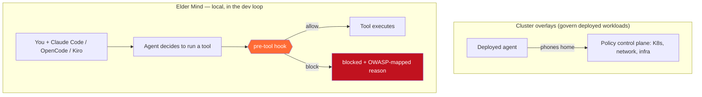
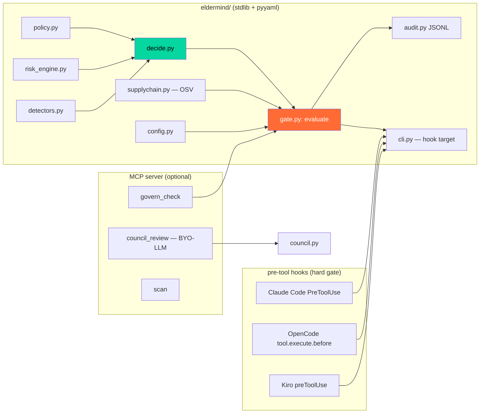
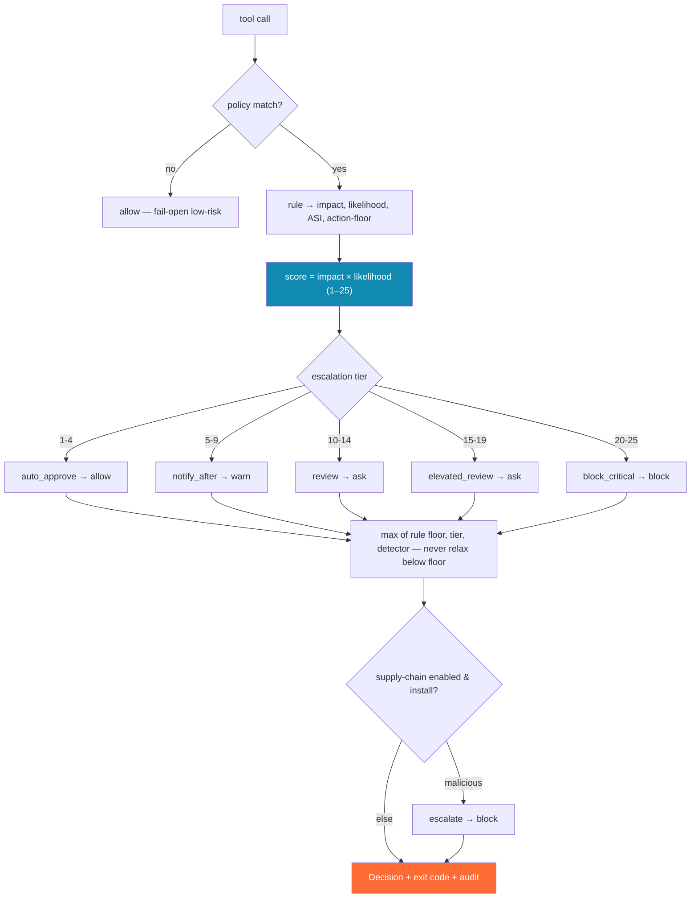
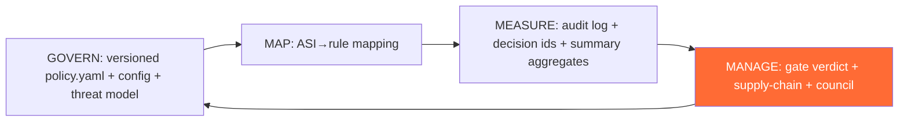

# Architecture

How the Elder Mind Governance Harness is put together, in diagrams.

## Where it sits — the wedge

Governance runs **as the agent's own pre-tool-use hook**, locally, not at a cluster control plane.



## Runtime loop — every tool call

```mermaid
sequenceDiagram
    participant A as Coding Agent
    participant H as Pre-Tool Hook (per harness)
    participant G as evaluate() (gate.py)
    participant D as decide() — deterministic
    participant S as supply-chain (OSV, opt-in)
    participant L as audit.jsonl
    A->>H: wants to run a tool (e.g. force-push, install)
    H->>G: {action, target, context}
    G->>D: policy match + impact×likelihood + detectors (offline)
    D-->>G: verdict + ASI tag + decision id
    G->>S: if enabled & install cmd → OSV check (curated override + API)
    S-->>G: clean / vulnerable / malicious
    G->>L: append decision (id, score, ASI, supply-chain, detectors)
    G-->>H: final verdict + reason + exit code
    H-->>A: allow / warn / ask / block (native)
    Note over A,L: decide() is offline & reproducible; only the opt-in OSV step may use the network.
```

## Component anatomy



`decide()` is the pure, offline brain (policy + risk + detectors). `gate.evaluate()` wraps it and adds the optional, network-touching supply-chain check. Hooks hard-block; the MCP server is advisory.

## Decision engine



## Standards as a loop (NIST AI RMF backbone)



See [`STANDARDS-MAP.md`](STANDARDS-MAP.md) for the honest per-ASI coverage and [`../THREAT_MODEL.md`](../THREAT_MODEL.md) for the trust boundary.
